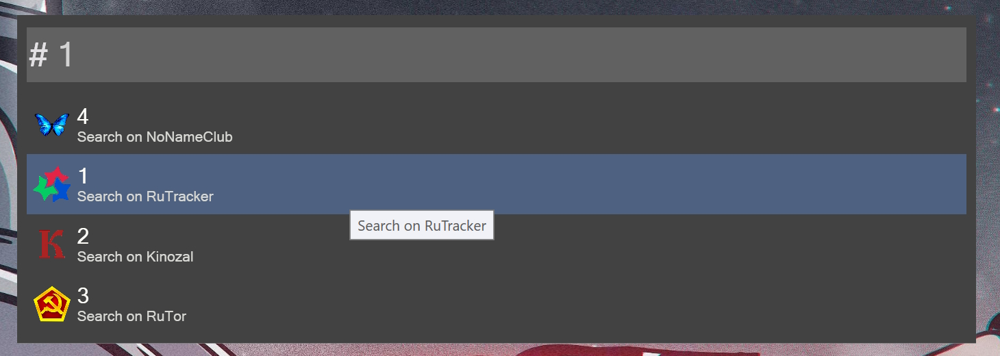
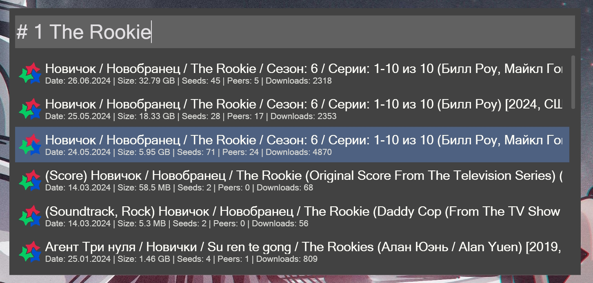
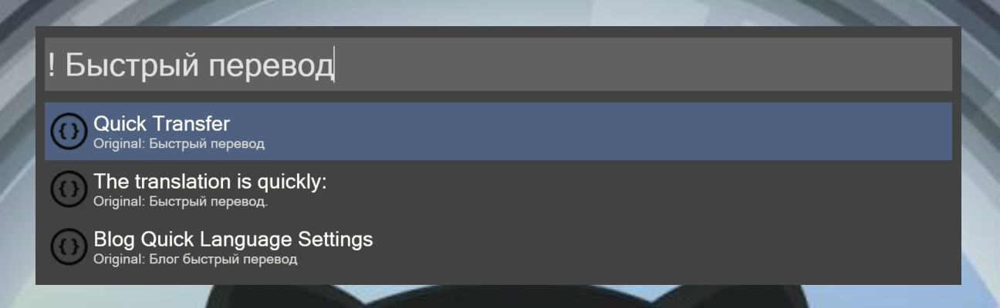
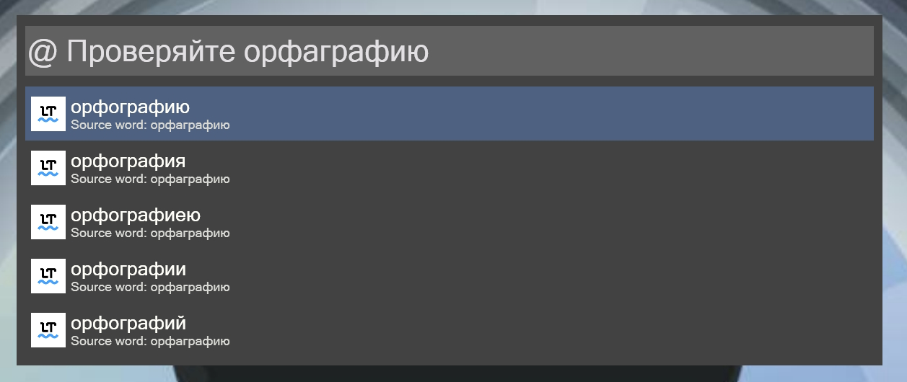
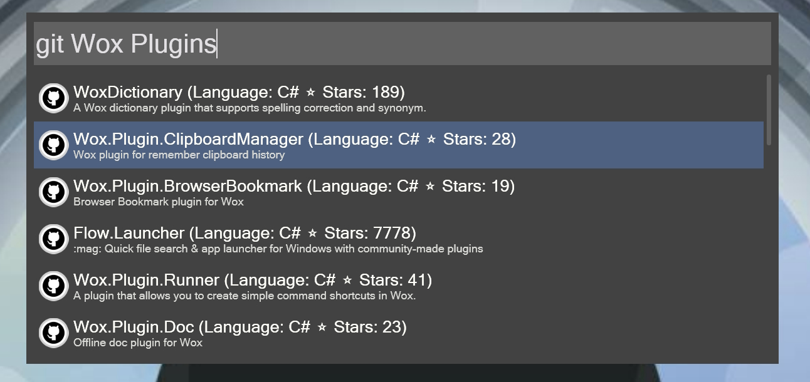

# Wox.Plugins

Set of Wox plugins working through API to search for torrents, repositories on GitHub, text translation and spell checking.

All plugins are published in the [plugin repository](http://www.wox.one/u/70837), which you can install using one command in the Wox input field.

<h2 align="left">
    
    Torrent Search
    
</h2>

Search distributions in **RuTracker**, **Kinozal**, **RuTor** and **NoName-Club** torrent trackers via [TorAPI](https://github.com/Lifailon/TorAPI).

The hotkey is used: `#` and the selected supplier in the range from 1 to 4.

<h5 align="center">
    
</h5>

An example of a search in RuTracker: `# 1 The Rookie`.

<h5 align="center">
    
</h5>

Installation: `wpm install Torrent.Search` from [Wox Plugins Repository](http://www.wox.one/plugin/431).

<h2 align="left">
    
    MyMemory Translator
</h2>

Fast text translation in MyMemory via free api. Supports translation between Russian and English by default.

The hotkey is used: `!`

Installation: `wpm install MyMemory` from [Wox Plugins Repository](http://www.wox.one/plugin/427).

<h1 align="center">
    
</h1>

<h2 align="left">
    
    LanguageTool
</h2>

Check texts for style and grammar via LanguageTool api.

The hotkey is used: `@`

Installation: `wpm install LanguageTool` from [Wox Plugins Repository](http://www.wox.one/plugin/428).

<h1 align="center">
    
</h1>

<h2 align="left">
    
    GitHub Search
</h2>

Search repositories on GitHub via api.

The keyword is used: `git`

Installation: `wpm install GitHub.Search` from [Wox Plugins Repository](http://www.wox.one/plugin/429).

<h1 align="center">
    
</h1>