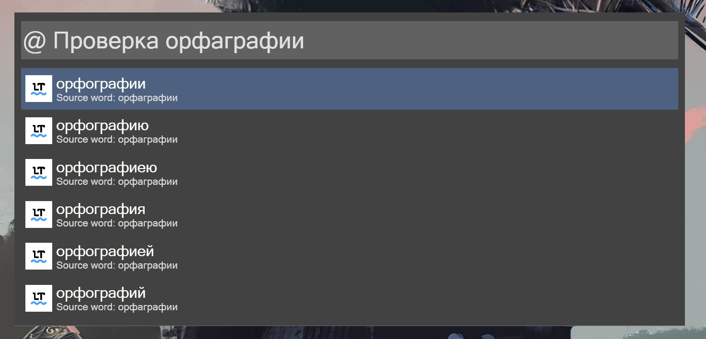

## Wox.Plugin.LanguageTool

Check texts for style and grammar via LanguageTool api.

The hotkey is used: `@`

Installation: `wpm install LanguageTool` from [Wox Plugins Repository](http://www.wox.one/plugin/428).

<h1 align="center">
    
</h1>