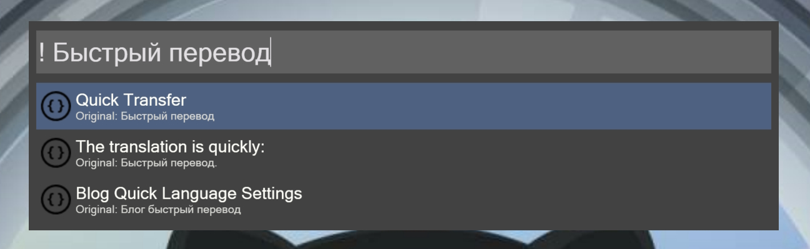

## Wox.Plugin.MyMemory

Fast text translation in MyMemory via free api. Supports translation between Russian and English by default.

Installation: `wpm install MyMemory` from [Wox Plugins Repository](http://www.wox.one/plugin/427).

The hotkey is used: `!`

<h1 align="center">
    
</h1>