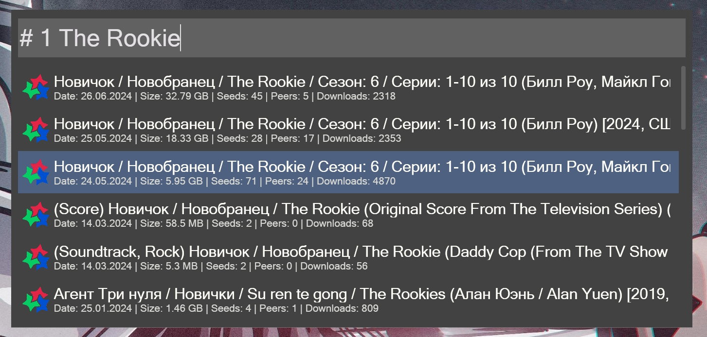

## Wox.Plugin.Torrent.Search

Search distributions in **RuTracker**, **Kinozal**, **RuTor** and **NoName-Club** torrent trackers via [TorAPI](https://github.com/Lifailon/TorAPI).

Installation: `wpm install Torrent Search` from [Wox Plugins Repository](http://www.wox.one/plugin/431).

The hotkey is used: `#` and the selected supplier in the range from 1 to 4.

<h5 align="center">
    
</h5>

An example of a search in RuTracker: `# 1 The Rookie`.

<h5 align="center">
    
</h5>